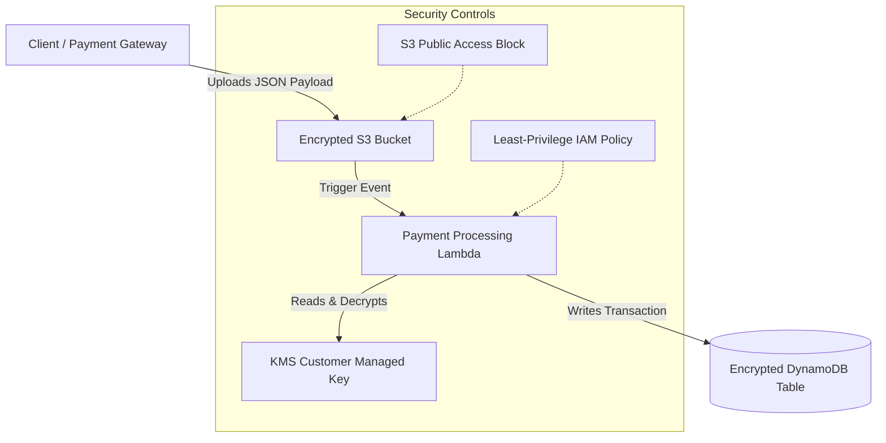

# Secure AWS Payments API Infrastructure

A secure, multi-service AWS infrastructure provisioned using Terraform, emulated locally via LocalStack, and validated using a custom automated compliance framework. This project models a production-grade, PCI-compliant payment event processing pipeline designed for fintech workloads.

---

## 🏗️ Architecture Overview

The system processes incoming payment events dynamically through a event-driven serverless architecture:



### Infrastructure Components
1. **AWS KMS Customer Managed Key (CMK)**: Enables encryption-at-rest across all services. Includes key policies, key rotation, and isolated access grants.
2. **Amazon S3 (Payment Events)**: Secure storage for raw payment JSON files. Configured with:
   - Server-Side Encryption (SSE-KMS) utilizing the custom CMK.
   - Versioning enabled for auditability.
   - Public Access Block (`BlockPublicAcls`, `BlockPublicPolicy`, `IgnorePublicAcls`, `RestrictPublicBuckets` set to `true`).
3. **AWS Lambda (Payment Processor)**: Parses incoming payment events, extracts billing metrics (`paymentId`, `amount`), and writes to the database. Runs under a custom least-privilege IAM execution role.
4. **Amazon DynamoDB (Transactions Table)**: Highly performant ledger encrypted at rest with the custom CMK.

---

## 🔒 Security & Compliance Safeguards

This project implements enterprise-grade compliance policies:
* **Least-Privilege IAM**: The Lambda execution role has no wildcard actions (`*`) for data operations. It is strictly limited to reading the specific S3 bucket, decrypting with the custom KMS key, and putting items into the specific DynamoDB table.
* **Public Access Prevention**: S3 buckets block all public ACLs and policies, preventing accidental leaks.
* **KMS Envelope Encryption**: All data is encrypted at rest using a dedicated KMS Key rather than AWS-managed default keys, ensuring customer-managed governance.
* **Workspace Isolation**: Terraform workspaces (`dev` and `staging`) isolate states and resource namespaces dynamically (e.g., `transactions-dev` vs `transactions-staging`).

---

## 🛠️ Local Development Setup

### Prerequisites
- [Docker](https://www.docker.com/) and Docker Compose
- [Terraform CLI](https://developer.hashicorp.com/terraform/downloads) (v1.0.0+)
- [AWS CLI v2](https://docs.aws.amazon.com/cli/latest/userguide/getting-started-install.html)
- Python 3.8+ (for Lambda/local script execution)
- `jq` utility (command-line JSON parser)

### 1. Launch the Emulated AWS Environment (LocalStack)
LocalStack is configured to emulate S3, DynamoDB, IAM, KMS, and Lambda.

```bash
# Start LocalStack in detached mode
docker-compose up -d
```

### 2. Configure Environment Variables
Copy the template and configure your local environments. The defaults target LocalStack:
```bash
cp .env.example .env
```

Ensure `.env` contains:
```env
AWS_ACCESS_KEY_ID=test
AWS_SECRET_ACCESS_KEY=test
AWS_DEFAULT_REGION=us-east-1
AWS_ENDPOINT_URL=http://localhost:4566
```

---

## 🚀 Terraform Provisioning

Configure and provision infrastructure isolated by environments (workspaces).

### 1. Initialize Terraform
```bash
terraform init
```

### 2. Create and Select Workspaces
```bash
# Create workspaces
terraform workspace new dev
terraform workspace new staging

# Select the target workspace
terraform workspace select dev
```

### 3. Deploy to LocalStack
Deploy the infrastructure resources. Terraform automatically redirects endpoints to LocalStack when `use_localstack` is enabled (default: `true`).
```bash
terraform apply -auto-approve
```

---

## 🧪 Verification & Testing

### 1. Execute Compliance Audits
Run the automated compliance check script to audit S3 blocks, encryption configurations, DynamoDB states, and IAM permissions.

```bash
# Executing on dev workspace
bash ./compliance_check.sh dev
```

**Expected Output:**
```text
Retrieving policy ARN...
--- Running Compliance Checks for workspace: dev ---
[CHECK 1] Verifying S3 Public Access Block on bucket: fintech-payment-events-dev...
  ✓ SUCCESS: S3 bucket has public access block fully enabled.
[CHECK 2] Verifying S3 Encryption on bucket: fintech-payment-events-dev...
  ✓ SUCCESS: S3 bucket is encrypted with aws:kms.
[CHECK 3] Verifying DynamoDB Encryption on table: transactions-dev...
  ✓ SUCCESS: DynamoDB table encryption is enabled.
[CHECK 4] Verifying IAM policy for wildcard actions...
  ✓ SUCCESS: No forbidden wildcard actions found in IAM policy.
--- All Compliance Checks Passed! ---
```

### 2. End-to-End Integration Flow
Test the full event pipeline by uploading a payload and querying the output.

1. **Upload a Sample Payment Payload**:
   *Note: Set `AWS_REQUEST_CHECKSUM_CALCULATION=when_required` to bypass newer AWS CLI streaming checksum incompatibilities with LocalStack.*
   ```bash
   # Windows (CMD)
   set AWS_ACCESS_KEY_ID=test
   set AWS_SECRET_ACCESS_KEY=test
   set AWS_DEFAULT_REGION=us-east-1
   set AWS_REQUEST_CHECKSUM_CALCULATION=when_required
   aws --endpoint-url=http://localhost:4566 s3 cp test_payment.json s3://fintech-payment-events-dev/test_payment.json
   ```

2. **Verify Database Insertion**:
   Query the DynamoDB table to verify that the Lambda function triggered, decrypted, and successfully processed the record.
   ```bash
   aws --endpoint-url=http://localhost:4566 dynamodb scan --table-name transactions-dev
   ```

   **Expected Output:**
   ```json
   {
       "Items": [
           {
               "Status": {"S": "PROCESSED"},
               "Bucket": {"S": "fintech-payment-events-dev"},
               "Amount": {"N": "99.99"},
               "ObjectKey": {"S": "test_payment.json"},
               "PaymentID": {"S": "pay-123456"},
               "Timestamp": {"S": "2026-05-30T14:10:19.709284"},
               "TransactionID": {"S": "test_payment.json-2026-05-30T14:10:19.709172"}
           }
       ],
       "Count": 1,
       "ScannedCount": 1
   }
   ```
