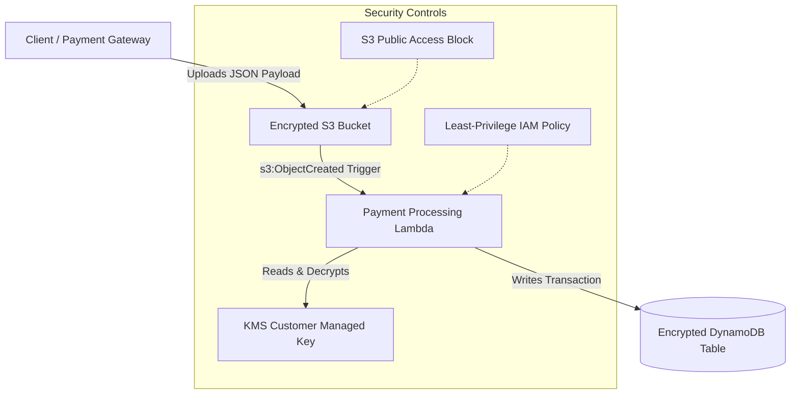

# Secure AWS Payments API Infrastructure

A secure, multi-service AWS infrastructure provisioned using Terraform, emulated locally via LocalStack, and validated using a custom automated compliance framework. This project models a production-grade, PCI-compliant payment event processing pipeline designed for fintech workloads.

---

## 🏗️ Architecture Overview

The system processes incoming payment events through an event-driven serverless architecture:



### Data Flow

1. **Initiation**: A client uploads a JSON payment event file to the S3 bucket.
2. **Trigger**: S3 sends an `s3:ObjectCreated` event notification to the Lambda function.
3. **Authorization**: Lambda assumes its IAM execution role with strictly scoped permissions.
4. **Processing**: The function reads the payment file from S3, parses it, and writes a transaction record to DynamoDB.
5. **Encryption**: Both S3 and DynamoDB are encrypted at rest using a customer-managed KMS key with automatic rotation.

### Infrastructure Components

| Component | Terraform Resource | Purpose |
|-----------|-------------------|---------|
| **KMS CMK** | `aws_kms_key.fintech_key` | Encryption-at-rest with auto-rotation |
| **KMS Alias** | `aws_kms_alias.fintech_key_alias` | Human-readable key identifier |
| **S3 Bucket** | `aws_s3_bucket.payment_events` | Versioned, KMS-encrypted, public-access-blocked storage |
| **DynamoDB Table** | `aws_dynamodb_table.transactions` | KMS-encrypted ledger with point-in-time recovery |
| **IAM Role** | `aws_iam_role.lambda_payment_processor_role` | Least-privilege Lambda execution role |
| **Lambda Function** | `aws_lambda_function.process_payment_lambda` | Event-driven payment processor |

---

## 🔒 Security & Compliance Safeguards

| Control | Implementation |
|---------|---------------|
| **Least-Privilege IAM** | No wildcard actions on data services. Scoped to `s3:GetObject`, `dynamodb:PutItem`, `kms:Decrypt`, `kms:GenerateDataKey` on specific resource ARNs. |
| **Public Access Prevention** | S3 `BlockPublicAcls`, `BlockPublicPolicy`, `IgnorePublicAcls`, `RestrictPublicBuckets` all `true`. |
| **KMS Envelope Encryption** | Customer-managed key with automatic key rotation enabled. |
| **Point-in-Time Recovery** | DynamoDB PITR enabled for disaster recovery. |
| **Workspace Isolation** | Terraform workspaces isolate state and resource names (`transactions-dev` vs `transactions-staging`). |
| **Resource Tagging** | All resources tagged with `Project`, `Environment`, `ManagedBy`, `Compliance`, and `DataClass`. |

---

## 📁 Project Structure

```
Secure-AWS-Payments-API/
├── src/
│   └── process_payment.py   # Lambda handler (reads S3, writes DynamoDB)
├── docker-compose.yml       # LocalStack container configuration
├── main.tf                  # Terraform resources (KMS, S3, DynamoDB, IAM, Lambda)
├── variables.tf             # Input variables with validation
├── outputs.tf               # Output definitions (ARNs, names, IDs)
├── compliance_check.sh      # 7-check automated compliance audit
├── .env.example             # Environment variable template
├── .gitignore               # Git ignore rules
└── README.md                # This file
```

---

## 🛠️ Local Development Setup

### Prerequisites

- [Docker](https://www.docker.com/) and Docker Compose
- [Terraform CLI](https://developer.hashicorp.com/terraform/downloads) (v1.0.0+)
- [AWS CLI v2](https://docs.aws.amazon.com/cli/latest/userguide/getting-started-install.html)
- [jq](https://jqlang.github.io/jq/download/) (command-line JSON parser)
- Python 3.8+

### 1. Launch LocalStack

```bash
docker-compose up -d
# Verify health
curl http://localhost:4566/_localstack/health
```

### 2. Configure Environment Variables

```bash
cp .env.example .env
```

> **Note:** No real AWS credentials are needed. LocalStack accepts any credentials — the defaults (`test`/`test`) are dummy placeholders.

---

## 🚀 Terraform Provisioning

### 1. Initialize Terraform

```bash
terraform init
```

### 2. Create and Select Workspaces

```bash
terraform workspace new dev
terraform workspace new staging
terraform workspace select dev
```

### 3. Deploy

```bash
terraform apply -auto-approve
```

**Expected Output:**
```
Apply complete! Resources: 13 added, 0 changed, 0 destroyed.

Outputs:

dynamodb_table_arn   = "arn:aws:dynamodb:us-east-1:000000000000:table/transactions-dev"
dynamodb_table_name  = "transactions-dev"
iam_policy_arn       = "arn:aws:iam::000000000000:policy/lambda-payment-processor-policy-dev"
iam_role_arn         = "arn:aws:iam::000000000000:role/lambda-payment-processor-role-dev"
kms_alias_name       = "alias/fintech-cmk-dev"
kms_key_arn          = "arn:aws:kms:us-east-1:000000000000:key/47e490fb-..."
kms_key_id           = "47e490fb-..."
lambda_function_arn  = "arn:aws:lambda:us-east-1:000000000000:function:process-payment-dev"
lambda_function_name = "process-payment-dev"
s3_bucket_arn        = "arn:aws:s3:::fintech-payment-events-dev"
s3_bucket_name       = "fintech-payment-events-dev"
```

---

## 🧪 Verification & Testing

### 1. Compliance Audit (7 Checks)

```bash
bash ./compliance_check.sh dev
```

**Output of Successful Compliance Run:**
```
Retrieving policy ARN...
  Policy ARN: arn:aws:iam::000000000000:policy/lambda-payment-processor-policy-dev

===========================================================================
  COMPLIANCE AUDIT — Workspace: dev
===========================================================================

[CHECK 1/7] S3 Public Access Block on bucket: fintech-payment-events-dev
  ✓ PASS: All four public access block settings are enabled.
[CHECK 2/7] S3 Encryption on bucket: fintech-payment-events-dev
  ✓ PASS: S3 bucket is encrypted with aws:kms.
[CHECK 3/7] S3 Versioning on bucket: fintech-payment-events-dev
  ✓ PASS: S3 bucket versioning is enabled.
[CHECK 4/7] DynamoDB Encryption on table: transactions-dev
  ✓ PASS: DynamoDB table encryption is ENABLED.
[CHECK 5/7] KMS Key Rotation
  ✓ PASS: KMS key rotation is enabled.
[CHECK 6/7] IAM Policy wildcard audit
  ✓ PASS: No forbidden wildcard actions found in IAM policy.
[CHECK 7/7] Lambda function configuration: process-payment-dev
  ✓ PASS: Lambda function is configured with correct role and runtime.

===========================================================================
  RESULT: 7/7 checks passed
===========================================================================
--- All Compliance Checks Passed! ---
```

### 2. End-to-End Integration Test

```bash
# Set environment (Windows CMD)
set AWS_ACCESS_KEY_ID=test
set AWS_SECRET_ACCESS_KEY=test
set AWS_DEFAULT_REGION=us-east-1
set AWS_REQUEST_CHECKSUM_CALCULATION=when_required

# Upload test payload
aws --endpoint-url=http://localhost:4566 s3 cp test_payment.json s3://fintech-payment-events-dev/test_payment.json

# Wait ~10 seconds, then verify DynamoDB
aws --endpoint-url=http://localhost:4566 dynamodb scan --table-name transactions-dev
```

**Expected DynamoDB Output:**
```json
{
    "Items": [
        {
            "Status": {"S": "PROCESSED"},
            "Bucket": {"S": "fintech-payment-events-dev"},
            "Amount": {"N": "99.99"},
            "ObjectKey": {"S": "test_payment.json"},
            "PaymentID": {"S": "pay-123456"},
            "Timestamp": {"S": "2026-06-06T06:10:12.690725+00:00"},
            "TransactionID": {"S": "test_payment.json-2026-06-06T06:10:12.690725+00:00"}
        }
    ],
    "Count": 1,
    "ScannedCount": 1
}
```

---

## 🔄 Workspace-Based Environment Isolation

```bash
terraform workspace list
#   default
# * dev
#   staging

terraform workspace select staging
terraform apply -auto-approve
# Creates: transactions-staging, fintech-payment-events-staging, etc.
```

---

## 🧹 Cleanup

```bash
terraform destroy -auto-approve
docker-compose down
```

---

## 📋 FAQ

| Question | Answer |
|----------|--------|
| **Do I need real AWS credentials?** | No. LocalStack accepts `test`/`test`. |
| **Lambda not triggering?** | Check `aws_lambda_permission` and S3 notification config. Run `docker logs localstack_fintech`. |
| **Why Terraform workspaces?** | Isolated state files per environment prevent cross-env accidents. |
| **Why no wildcard IAM actions?** | Least Privilege — minimizes blast radius if credentials are compromised. |
| **Why KMS key rotation?** | Compliance requirement — automatically rotates key material annually. |
